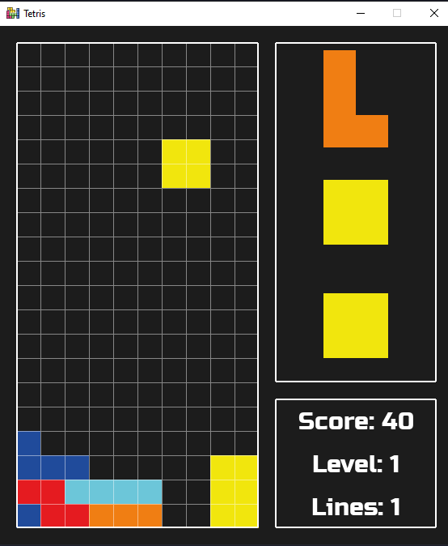

# Tetris - With Python

## Table of contents

- [Overview](#overview)
  - [The Game](#the-game)
- [My process](#my-process)
  - [Built with](#built-with)
  - [Useful resources](#useful-resources)
- [Author](#author)

## Overview

This project is a version of Tetris built entirely in Python.

  

### The Game

It works like any other classic Tetris game, it has 7 different pieces called Tetrominoes:

| I shape|J shape|L shape|
|:-------:|:--------:|:---------:|
|  |  |  |

| O shape|S shape|T shape|
|:-------:|:--------:|:---------:|
|  |  |  |

| Z shape|
|:-------:|
|  | 

As the players position the tetrominoes where they want, new pieces (the ones displayed on the right) are generated and the game flows. As the levels increases, the tetrominoes fall faster, increasing the challenge. For every ten lines cleared, the level is increased by one.

The players should be able to:

- Rotate the tetrominoes (unless it's the *O* shape that can't be rotated);
- See the next three tetrominoes, so they can plan their next move;
- See the score, level and the number of lines that have been cleared.

## My process

### Built with

The game was entirely built with Python, using the [Pygame](https://www.pygame.org/docs/), a framework used to (as the name suggests) build games.

### Useful resources

- [Net Ninja](https://netninja.dev/p/build-a-tetris-clone-using-pygame) - My version was based on the one that's linked here. In fact I used the same assets they used.

## Author

You can find more about me on my social media

- LinkedIn - [alessandra-santos-oliveira](https://www.linkedin.com/in/alessandra-santos-oliveira/)
- Twitter - [@itsale_o](https://www.twitter.com/itsale_o)

